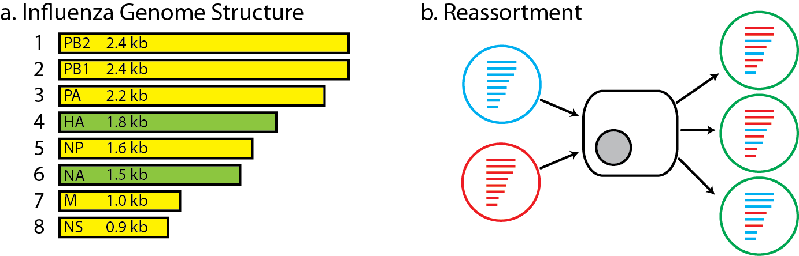
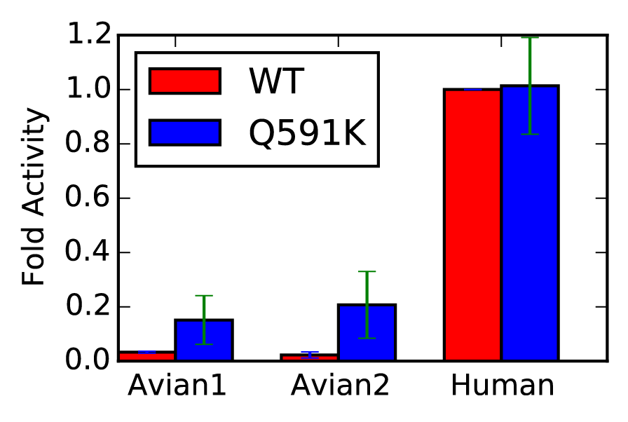

# Data science for pathogen genomic surveillance: predicting phenotype from genotype

- Eric J. Ma
- PhD Candidate
- Runstadler Lab, MIT Biological Engineering

Repository: github.com/ericmjl/genotype-phenotype-talk

---


## A little about me

- 5th year PhD Candidate in the Runstadler Lab at MIT.
- I solve infectious disease data science problems in Python. 
- Specific problems I'm working on to date:
    + Computing the quantitative importance of reticulate evolutionary strategies for pathogen host switches. (*in writing*)
    + Quantitatively predicting viral phenotype from sequence data. (*today's talk*)
    + Building my own DBJ assembler. (*for fun*)
    + Figuring out how to phase influenza genomes from mixed infections. (*not just for fun*)


---


## The Problem

Given only its genomic sequence, how do we tell whether a pathogen is going to be dangerous or not?

This is one of the central problems of **using genomic surveillance for pathogen risk assessment**.

---

## Influenza



```
class Influenza(Pathogen):
    def __init__(self):
        self.substitution_rate = 10**(-3)  # in units subst/(nt.yr)
        self.polymerase_genes = set([1, 2, 3, 5])`
        self.segments = range(1,9)
        self.can_reassort = self.has_segments()
```


---


## How it's done now

1. Look for known mutations that are experimentally tested to enhance some pathogenesis-related phenotype.
2. Experimentally try to evolove those mutations in the lab.
3. Expert panel of *opinions*. (reference: CDC **I**nfluenza **R**isk **A**ssessment **T**ool)

## How it should be done

1. Quantitative biochemical measures of pathogenesis.
2. Standardized, safe, and scalable biochemical assays to match genotype and phenotype.
3. Measurements done on both host *and* pathogen.

Focus today: pathogen side.

---

## Difficulties



- Presence of mutation may enhance genotype, but may not necessarily cause a "dangerous levels" of activity 
- Non-linear mapping from genotype to phenotype - expert rules alone are not enough
- Lack of high quality genotype-phenotype data
- Few assays measure biochemical phenotype that is plausibly related to pathogenesis
- Novel sequence diversity generated through error-prone polymerase

---

## Vision


- Identify biochemical assays that quantitatively measure some property that is plausibly **relevant** to pathogenesis.
- Characterize population diversity for that protein.
- Train machine learning models on predictive features, to learn phenotype from genotype.
- Characterize risk profile.

---

## Vision (Python redux)

```
assays = [ReplicationRate(data1), 
          DrugResistance(data2), 
          AntigenicDistance(data3)]

models = []
for assay in assays:
    model = MachineLearningModel(assay)
    model.train()
    models.append(model)
```

---


