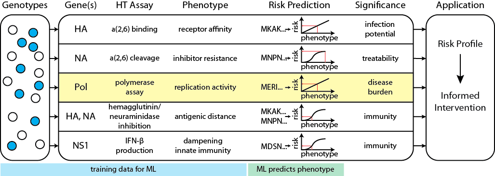

# Data science for pathogen genomic surveillance: predicting phenotype from genotype


- Eric J. Ma
- PhD Candidate
- Runstadler Lab, MIT Biological Engineering

Follow slides online: [http://bit.ly/gptalk-em][github_repo]

(This repo has really bad commit messages. You have been warned.)

[github_repo]: http://bit.ly/gptalk-em

---

## A little about the Runstadler Lab


- **Influenza surveillance** in wild animal populations
- Specific problems:
    + Infection dynamics in wild animals
    + Molecular characterization of viral isolates
    + Experimental evolution to understand viral dynamics
    + Virus-environment interactions

---

## A little about me

- 5th year PhD Candidate & Resident Hacker in the Runstadler Lab, MIT Biological Engineering.
- Self-taught 3 year-old Pythonista.
- I solve infectious disease data science problems using the Python programming language.
- Specific problems to date:
    + Computing the quantitative importance of reticulate evolutionary strategies for pathogen host switches. (*in writing*)
    + Quantitatively predicting viral phenotype from sequence data. (*today's talk*)
    + Building my own influenza DBG assembler. (*for fun*)
    + Figuring out how to phase influenza genomes from mixed infections. (*not just for fun*)

---

## Today's Goals

1. Outline R21 proposal to predict phenotype from genotype.
2. Show with live code that, given high quality data, it is easy to get up and going.

---

## The Problem(s)

Given only its genomic sequence, how do we tell whether a pathogen is going to be dangerous or not?

How can we better **use genomic surveillance for pathogen risk assessment**?

Can we do better **preventative surveillance of zoonotic pathogens**?

---

## Influenza

The specific pathogen I work with is the Influenza A Virus.


```python
class Influenza(Pathogen):
    def __init__(self):
        self.substitution_rate = 10**(-3)  # in units subst/(nt.yr)
        self.polymerase_genes = set([1, 2, 3, 5])
        self.segments = range(1,9)
        self.can_reassort = self.has_segments(True)
```


---


## How influenza genomic surveillance is done now
1. Chase down outbreaks.
2. Look for known mutations that are experimentally tested to enhance some pathogenesis-related phenotype.
3. Experimentally try to evolove those mutations in the lab.
4. Expert panel inferring rules from publications. (reference: [CDC **I**nfluenza **R**isk **A**ssessment **T**ool][irat])

## How we think genomic surveillance should be done
1. Sample source before sink.
2. Quantitative biochemical measures relevant to pathogenesis.
3. Standardized, safe, and scalable biochemical assays to match genotype and phenotype.
4. Measurements done on both host *and* pathogen.

[irat]: http://www.cdc.gov/flu/pandemic-resources/tools/risk-assessment.htm

---

## Difficulties


- **Sufficiency/Necessity**: Presence of mutation may enhance phenotype, but may not necessarily cause a "dangerous phenotype levels" 
- **Epistasis**: Non-linear mapping from genotype to phenotype - expert rules alone are not enough
- **Data**: Lack of high quality genotype-phenotype data
- **Experiments**: Not many assays measure biochemical phenotype that is plausibly related to pathogenesis
- **Biology**: Novel sequence diversity generated through error-prone polymerase

---

## Our Plan: Characterize the Polymerase


- **Rational** to cover polymorphic diversity.
- **High throughput** library construction & verification
- **Matched** phenotype from genotype
- **Machine learning** models to predict RNA replication rate
- **Open data** via web interface and API 

---

## Vision


- **Biochemical assays**: quantitative measure *relevant* to pathogenesis
- **Characterize**: population diversity
- **Machine learning**: learn mapping of phenotype from genotype.
- **Model**: risk profile.

---

## Vision in Code

```python
# Collect data
assay_data = [ReplicationRate(data1), 
              DrugResistance(data2), 
              AntigenicDistance(data3)]

# Train ML models
models = []
for data in assay_data:
    model = MachineLearningModel(data)
    model.train()
    models.append(model)

# Compute risk profile
risk_profile = AggregateModelResults(models)

# Make predictions
new_virus = Sequences(viral_sequence)
new_virus_risk = risk_profile.predict(new_virus)
```

---

## Can we do this?


- **Parallel problems**: HIV drug resistance

[Stanford HIV Drug Resistance Database][stanford_db]: 

1. comprehensive
2. high quality standardized data
3. sequence matched to fold drug resistance phenotype

[stanford_db]: http://hivdb.stanford.edu

---

## Live Demo

- [static version][github]

[github]: https://github.com/ericmjl/hiv-resistance-prediction/blob/master/Predict%20HIV%20Genotype%20from%20Phenotype%20-%20Custom%20Funcs.ipynb

- Tools used
    - [scikit-learn][sklearn] (aka sklearn): general purpose machine learning library
    - [nolearn][nolearn]: sklearn API-compatible neural network library

[sklearn]: http://scikit-learn.org/stable/
[nolearn]: https://pythonhosted.org/nolearn/

---

## Genomic Surveillance of the Future

1. **Quantitative Precision**: Precision medicine needs to be complemented with precision prevention. 
2. **Predictive Surveillance**: We can tell what will be dangerous before it jumps to humans & farms.

---

## With Thanks


- [Jon Runstadler][runlab] (advisor, MIT)
- [Islam Hussein][ihus] (data, MIT)
- [Mark Bathe][lcbb] (committee chair & GPU access, MIT)
- [JP Onnela][jp] (committee member, HSPH)
- [Danny Park][dpark] (invitation, Broad Institute)

I'd love to set a time to chat with everybody!

[dpark]: http://www.sabetilab.org/daniel-j-park/
[ihus]: http://www.islamhussein.com
[runlab]: https://runstadlerlab.mit.edu
[lcbb]: http://lcbb.mit.edu
[jp]: http://www.hsph.harvard.edu/onnela-lab/
